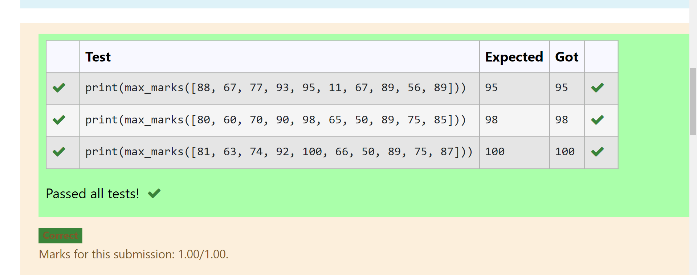
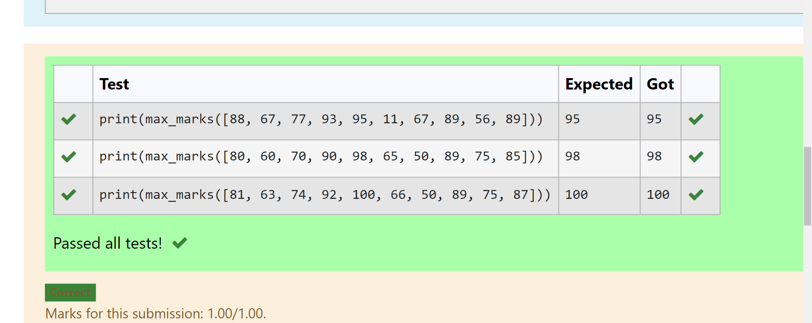
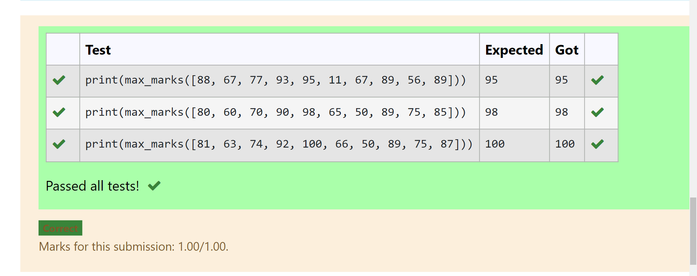

# Find the maximum of a list of numbers
## DATE:05.09.2023
## Aim:
To write a program to find the maximum of a list of numbers.
## Equipment’s required:
1.	Hardware – PCs
2.	Anaconda – Python 3.7 Installation / Moodle-Code Runner
## Algorithm:
1.	Get the list of marks as input
2.	Use the sort() function or max() function or use the for loop to find the maximum mark.
3.	Return the maximum value
## Program:
i)	# To find the maximum of marks using the list method sort.
```
##Program to mark the maximum of marks using the list method sort
##Developed by: PAVANA G
##RegisterNumber: 212222230105

def max_marks(marks):
    marks.sort()
    max=marks[-1]
    return max
```
ii)	# To find the maximum marks using the list method max().
```
##Program to find the maximum marks using the list method max().
##Developed by: PAVANA G
##RegisterNumber: 212222230105

def max_marks(marks):
    max_marks=max(marks)
    return max_marks
```
iii) # To find the maximum marks without using builtin functions.
```
##Program to the maximum marks without using builtin functions.
##Developed by: PAVANA G
##RegisterNumber: 212222230105

def max_marks(list1):
    max=list1[0]
    for i in list1:
        if i >max:
            max=i
    return max
```
## Sample Input and Output
 
## Output:
## To find the maximum of marks using the list method sort.

## To find the maximum marks using the list method max().

##  To find the maximum marks without using builtin functions.

## Result:
Thus the program to find the maximum of given numbers from the list is written and verified using python programming.
